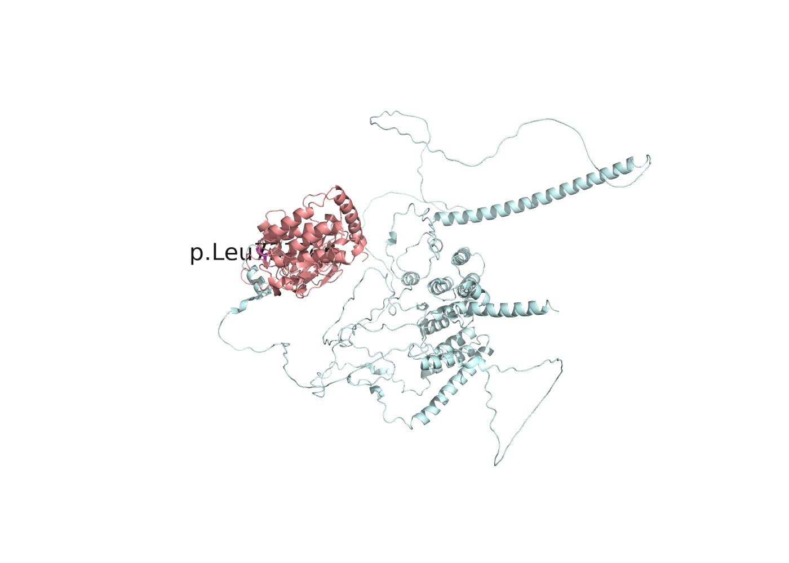
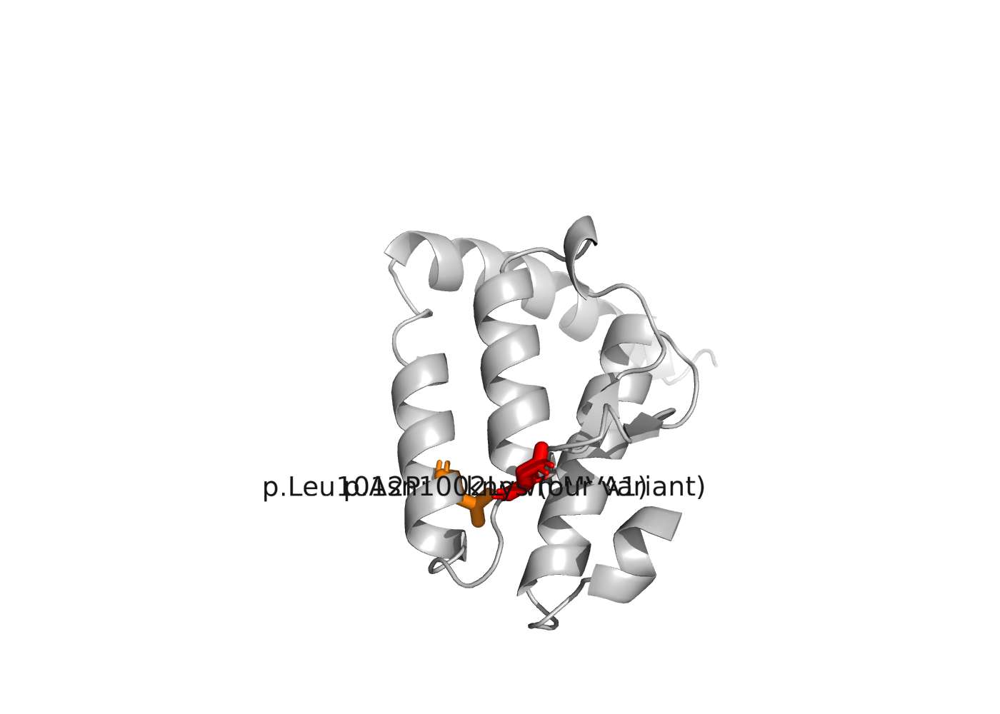
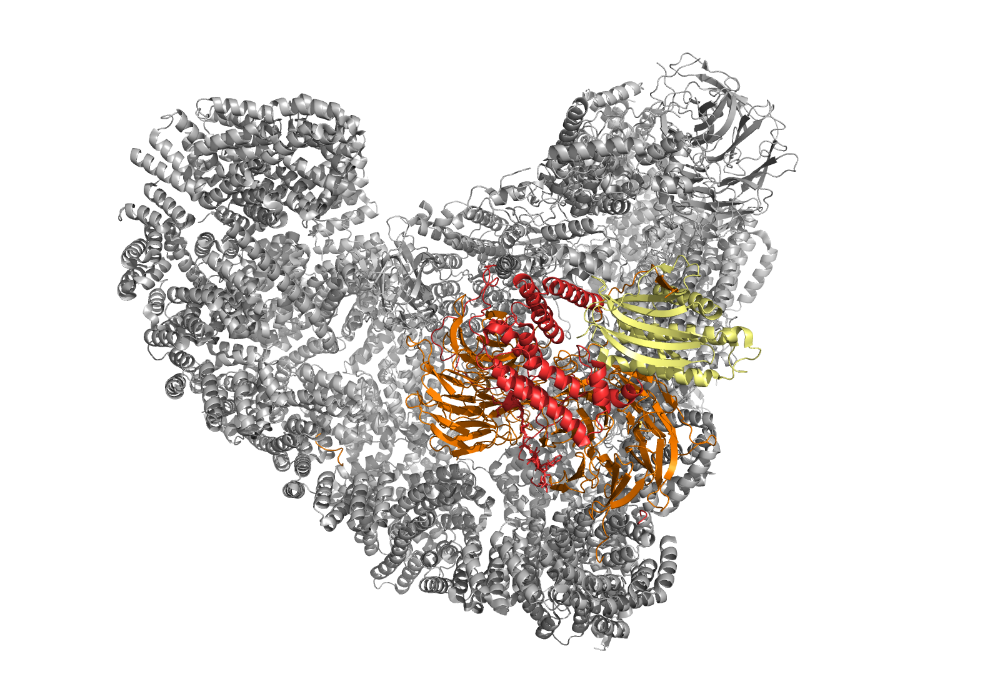
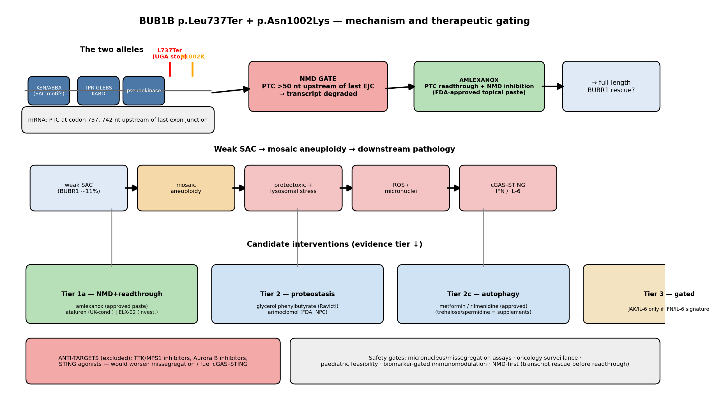

# Rare Disease, Real Kid: MVA Hackathon 2026

> One child. One genome. A 1050-amino-acid checkpoint protein cut short —
> and a computational case for what broke, and what might help.

Code, reports, and figures for
[SageBio/rare-disease-real-kid-mva-hackathon-2026](https://huggingface.co/spaces/SageBio/rare-disease-real-kid-mva-hackathon-2026).

- **HF user:** [Ryukijano](https://huggingface.co/Ryukijano)
- **GitHub (private during the hackathon):** https://github.com/Ryukijano/mva-hackathon-2026
- **Campaign wrap-up:** [`WHAT_WE_DID.md`](WHAT_WE_DID.md)



*AlphaFold O60566 — BUBR1. Cyan: residues 1–736 retained by the stop-gain allele
(all SAC degron motifs, TPR, GLEBS, KARD). Salmon: residues 737–1050 lost — the
entire C-terminal pseudokinase domain.*

## The call (Track 1)

A child with classic **mosaic variegated aneuploidy 1 (MVA1)** — microcephaly,
growth delay, Dandy-Walker malformation, childhood cancers. After annotating the
proband WGS with VEP 116 + AlphaMissense + popEVE and filtering a 17-gene
MVA/Atelis panel to rare functional alleles, **only *BUB1B* carried two hits**:

| Allele | GRCh38 | HGVS (NM_001211.6) | Evidence |
|---|---|---|---|
| 1 | `chr15:40,209,701 T>G` | `c.2210T>G` `p.Leu737Ter` | ClinVar **Pathogenic/Likely pathogenic** for MVA1 ([VCV000533901](https://www.ncbi.nlm.nih.gov/clinvar/variation/533901/), multi-submitter); gnomAD AC=115, 0 homozygotes; Loftee HC-LoF, `50_BP_RULE:PASS` — canonical NMD substrate |
| 2 | `chr15:40,220,612 T>G` | `c.3006T>G` `p.Asn1002Lys` | gnomAD singleton (AC=1); SIFT 0.01 / PolyPhen 0.997 / AlphaMissense **0.9229**; phyloP100way **4.80**; same protein change is a ClinVar VUS via `c.3006T>A` |

EPCR `0.95`, `finding_type=primary`, one row. The truncating + hypomorphic
missense architecture is the canonical *viable* MVA1 pattern (Hanks 2004;
biallelic null is embryonic lethal). *In trans* is **inferred**, not proven —
read-backed phasing is unresolved (10.9 kb gap ≫ 1.3 kb max insert) and the
submission says so.



*The pseudokinase C-lobe. Red: p.Asn1002Lys (our variant). Orange: p.Leu1012Pro —
a known MVA1 allele 10 residues away on the same αG helix.*

## How we checked ourselves

Before spending a submission shot we ran a **falsifier audit**
(`supplement/track1/locus_falsifier_audit.md`):

- every *BUB1B* ClinVar P/LP allele → only L737Ter present
- the known upstream regulatory SNP `chr15:40,117,088 G>A` → homozygous-ref at 46× depth
- CNV / SV / UPD / homozygous alternatives → none
- the rare intervening intronic SNV → SpliceAI 0.00, phyloP −0.41, no rsID
- **panel-completeness gap we caught ourselves:** the original 15-gene panel was
  missing **SLF2/SMC5** (MVA5/6 Atelis genes) — post-hoc check found only common
  polymorphisms in both; panel now 17 genes

Residual limitation disclosed everywhere: short-read SNV calling cannot exclude
cryptic structural/deep-intronic mechanisms; definitive phase needs parental
genotyping or long-range PCR + long reads.

## The reaction the checkpoint runs (Track 2 framing)



*PDB 6TLJ — the spindle assembly checkpoint in action. Grey: APC/C (the E3 ligase
that drives anaphase). Red: full-length **BUBR1 threading between the two CDC20
WD40 propellers (orange)**, with MAD2A (yellow). This is the molecular "reaction"
that p.Leu737Ter weakens.*

Because L737Ter is a canonical **NMD substrate** (50-bp rule passes; literature
shows BUBR1 PTC transcripts are degraded), Track 2 is gated by transcript rescue:

| Tier | Mechanism | Lead |
|---|---|---|
| **1a** | NMD inhibition + PTC readthrough | **amlexanox** (FDA-approved topical paste; systemic use investigational); ataluren (UGA-only, UK-conditional); ELX-02 (future) |
| 2 | Proteostasis / chaperone | glycerol phenylbutyrate (Ravicti), arimoclomol |
| 2c | mTORC1-independent autophagy | metformin, rilmenidine (approved); trehalose/spermidine (supplements) |
| 3 | Biomarker-gated immunomodulation | JAK/IL-6 only if IFN/IL-6 signature — with oncology surveillance |
| ✗ | **Anti-targets** | TTK/AURKB inhibitors, STING agonists, and sirolimus (mTORC1 inhibition itself promotes missegregation) |



LINCS/L2S2 transcriptomic screen: `0 ACCEPT / 2 WEAK / 674 REJECT` — reported as
a negative result, not a rescue claim. Full dossier:
`track2/track2_report.md` → `submissions/Ryukijano_track2_report.md`.

## Reproduce

```bash
# AIRE cluster
source /scratch/kcwp264/.aire_scratch_env.sh
conda env create -f environment.yaml && conda activate mva-hackathon
pip install -e .

# gated data (after accepting the DTA)
export HF_TOKEN=...
python scripts/download_data.py
bash scripts/setup_references.sh

python scripts/run_track1.py \
  --vcf data/WGS_EX2312012_HGWCNDSX7.vcf.gz \
  --pheno data/Challenge_Clinical_Phenotype_1.docx \
  -o submissions/Ryukijano_bub1b-compoundhet.csv
python -m pytest tests/ -q          # 39 tests incl. the scorer clone
```

## Repo map

```
configs/            17-gene panel, thresholds, AIRE paths
src/mva_hackathon/  variants (VEP parse, filter, score, pair, writer), eval (scorer clone)
scripts/            CLI + Slurm wrappers + WGS/phasing utilities
experiments/        ESM-1v, PrimeKG, ClinVar B/LB — see 2026-08-31_bub1b_computational/SUMMARY.md
track2/             ChEMBL screen, LINCS/L2S2, dossier, storyboard
submissions/        Track 1 CSV + both reports
supplement/         locus falsifier audit
figures/            PyMOL scripts, structures, PNGs, rotating GIFs, .pse sessions
tests/              39 tests (scorer parity, CSV schema, config)
docs/               project record, phasing memo, first-principles doc
```

## Data handling & AI disclosure

- Genome / BAM / VCF stay off this repo and must be deleted within 30 days of close.
- AI assistance: Anthropic API / agents under commercial terms (no training on inputs). Genome-scale files were never sent to third-party LLM APIs.

## Licence

Code, reports, figures: [CC BY 4.0](LICENSE). Patient data: gated, not redistributable.
